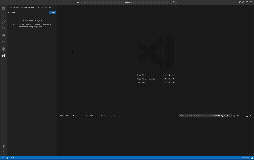

# [Experimental] SQL Server Connection String Translator

A VS Code extension that translates SQL Server connection strings between 7 different driver formats with intelligent auto-detection.


## Features

🔄 **Translate between 7 formats:**

- **SqlClient** (.NET / C#)
- **ODBC** (Open Database Connectivity)
- **OLEDB** (Object Linking and Embedding Database)
- **JDBC** (Java Database Connectivity)
- **PHP** (sqlsrv extension)
- **Python** (mssql / pyodbc)
- **Rust** (mssql-tds / tiberius)

✨ **Key Features:**

- **Smart auto-detection** with confidence scoring (high/medium/low)
- **OLEDB Provider auto-injection** - Automatically adds `Provider=MSOLEDBSQL;` as first parameter
- **Translate to single or all formats** with responsive grid layout
- **128+ keyword mappings** across all drivers
- **Comprehensive synonym support** (e.g., `Server` = `Data Source`, `UID` = `User ID`)
- **Syntax validation** with detailed error messages
- **External CSS stylesheet** for improved performance and maintainability
- **One-click copy buttons** for all translations
- **History sidebar** showing recent translations
- **Real-time detection badges** showing source format confidence
- **Keyboard shortcuts** for rapid workflow

## Installation

### From VSIX File

```bash
code --install-extension sql-connection-string-translator-0.0.1.vsix
```

### From VS Code

1. Download the `.vsix` file
2. Open VS Code Extensions view (`Ctrl+Shift+X` / `Cmd+Shift+X`)
3. Click `...` (More Actions) → `Install from VSIX...`
4. Select the downloaded file
5. Reload VS Code

## Usage

### Demo



### Open Translator Panel

1. Open Command Palette (`Ctrl+Shift+P` / `Cmd+Shift+P`)
2. Type "Connection String: Open Translator"
3. Press Enter

### Translate Selected Text

1. Select a connection string in your editor
2. Right-click and choose "Connection String: Translate Selection"
3. Or use Command Palette: "Connection String: Translate Selection"

### Translate from Clipboard

1. Copy a connection string to clipboard
2. Open Command Palette
3. Type "Connection String: Translate from Clipboard"

### Quick Translate

1. Open Command Palette
2. Type "Connection String: Quick Translate to..."
3. Paste your connection string
4. Select target format

## Keyboard Shortcuts

| Shortcut                    | Action                              |
| --------------------------- | ----------------------------------- |
| `Ctrl+Shift+C Ctrl+Shift+T` | Open Translator Panel               |
| `Ctrl+Enter`                | Translate (in panel)                |
| `Ctrl+Shift+Enter`          | Translate to All Formats (in panel) |

## Supported Keywords

The extension supports 128+ keywords across all drivers, including:

### Connection

- Server / Data Source / Address / Host
- Database / Initial Catalog
- Port

### Authentication

- User ID / UID / User
- Password / PWD
- Integrated Security / Trusted_Connection
- Authentication (Azure AD)

### Security

- Encrypt
- TrustServerCertificate
- HostNameInCertificate

### Timeouts

- Connect Timeout / Connection Timeout / Login Timeout
- Command Timeout

### Pooling

- Pooling / Connection Pooling
- Min Pool Size / Max Pool Size
- Connection Lifetime

### High Availability (HADR)

- MultiSubnetFailover
- ApplicationIntent
- FailoverPartner

### Application

- Application Name / App
- Workstation ID

## Warnings and Errors

### Python Driver Warnings

The Python (mssql) driver has a restricted keyword allowlist. Some keywords like `MultiSubnetFailover` are blocked and will generate warnings.

### Untranslatable Keywords

Some keywords are driver-specific and cannot be translated. These will be listed with the reason:

- `NOT_SUPPORTED` - Keyword not available in target driver
- `BLOCKED_ALLOWLIST` - Python driver restriction
- `DEPRECATED` - Keyword is deprecated
- `DRIVER_SPECIFIC` - Only works with source driver

## Examples

### SqlClient to OLEDB (with Provider Auto-Injection)

**Input (SqlClient):**

```text
Server=localhost;Database=TestDB;User ID=sa;Password=MyPass123;
```

**Output (OLEDB):**

```text
Provider=MSOLEDBSQL;Data Source=localhost;Initial Catalog=TestDB;User ID=sa;Password=MyPass123;
```

> **Note:** The `Provider=MSOLEDBSQL;` keyword is automatically injected as the first parameter when translating to OLEDB format, as it's mandatory per OLEDB specification.

### SqlClient to JDBC

**Input (SqlClient):**

```text
Server=myserver.database.windows.net;Database=mydb;User ID=admin;Password=secret;Encrypt=True;
```

**Output (JDBC):**

```text
jdbc:sqlserver://myserver.database.windows.net:1433;databaseName=mydb;user=admin;password=secret;encrypt=true;
```

### ODBC to Python

**Input (ODBC):**

```text
Driver={ODBC Driver 18 for SQL Server};Server=localhost;Database=mydb;Trusted_Connection=Yes;
```

**Output (Python):**

```python
Config(
    server='localhost',
    database='mydb',
    trusted_connection='Yes',
)
```

### SqlClient to Rust

**Input (SqlClient):**

```text
Server=localhost;Database=mydb;Integrated Security=True;
```

**Output (Rust):**

```rust
Config {
    server: "localhost".to_string(),
    database: Some("mydb".to_string()),
    trust_cert: true,
    ..Default::default()
}
```

## UI Design

### Translator Panel

The main translator panel features:

- **Input textarea** - Paste your connection string
- **Source driver dropdown** - Auto-detect or manually select source format
- **Detection badge** - Real-time confidence indicator (high/medium/low)
- **Target driver dropdown** - Select destination format
- **Action buttons:**
  - **Translate** - Convert to selected target format
  - **Translate to All Formats** - Generate all 7 formats in grid view
  - **Clear** - Reset the form

### All Formats View

When translating to all formats, results display in a responsive grid showing:
- Driver name and icon (Rust 🦀)
- Warning icons ⚠️ for untranslatable keywords (with hover tooltips)
- One-click copy button per format
- Color-coded output based on VS Code theme

### History Sidebar

The sidebar maintains a history of recent translations:
- Timestamp of each translation
- Source driver format
- Quick access to re-open previous translations

## Architecture

### Core Components

- **Parser** - Tokenizes connection strings into key-value pairs
- **Detector** - Identifies source driver format with confidence scoring
- **Mapper** - Translates keywords between driver formats (128+ mappings)
- **Generator** - Constructs target format connection strings
- **Validator** - Validates syntax and identifies errors/warnings

### Special Handling

#### OLEDB Provider Keyword
- **TO OLEDB**: Automatically injects `Provider=MSOLEDBSQL;` as first parameter if missing
- **FROM OLEDB**: Removes Provider keyword when translating to other formats
- Ensures compliance with OLEDB specification (Provider must be first)

#### Python Config Format
Generates Python `Config()` struct initialization:
```python
Config(
    server='value',
    database='value',
    # ...
)
```

#### Rust Config Format
Generates Rust struct initialization:
```rust
Config {
    server: "value".to_string(),
    database: Some("value".to_string()),
    // ...
}
```

## Requirements

- VS Code 1.80.0 or higher

## Extension Settings

This extension contributes the following settings:

- (Coming soon)

## Known Issues

- Rust output generates struct initialization code, not a traditional connection string
- Python output generates Config struct initialization, not a traditional connection string
- Python driver has a restricted allowlist; some keywords will generate warnings
- Some advanced driver-specific keywords may not have mappings in all target drivers

## Release Notes

### 0.0.1 - 2026-02-04

Initial release with comprehensive features:

- ✅ Translate between 7 SQL Server driver formats
- ✅ Smart auto-detection with confidence scoring
- ✅ **OLEDB Provider keyword auto-injection**
- ✅ External CSS stylesheet architecture
- ✅ 128+ keyword mappings with synonym support
- ✅ Syntax validation with detailed error messages
- ✅ Webview UI with responsive grid layout
- ✅ History sidebar for recent translations
- ✅ Context menu integration
- ✅ Keyboard shortcuts for rapid workflow
- ✅ One-click copy buttons

**Technical Details:**
- Extension size: 98 KB (92 files)
- Bundle size: 91.6 KB (optimized with webpack)
- CSS: External stylesheet with VS Code theme integration

> 📖 [Full Release Notes](release-notes/v0.0.1.md)

## Contributing

Contributions are welcome! 

**Repository:** [cheenamalhotra/sqlconnectionstrings](https://github.com/cheenamalhotra/sqlconnectionstrings)

### Areas for Contribution
- Additional driver support (PostgreSQL, MySQL)
- Enhanced keyword mappings
- UI/UX improvements
- Documentation and examples
- Test coverage expansion

## License

MIT License - See [LICENSE](LICENSE) file for details

---

## Feedback & Support

Found a bug or have a feature request? Please open an issue on [GitHub](https://github.com/cheenamalhotra/sqlconnectionstrings/issues).

**Developed with ❤️ for the SQL Server community**
